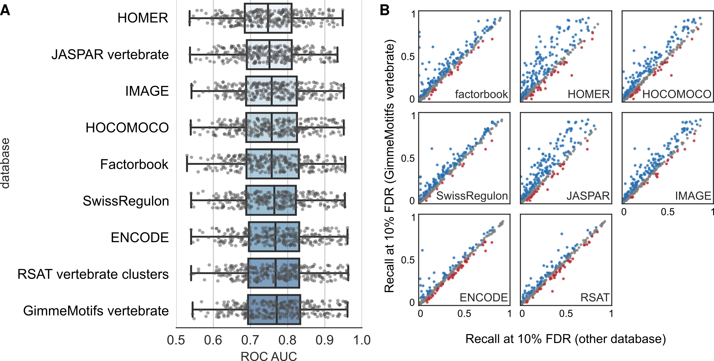
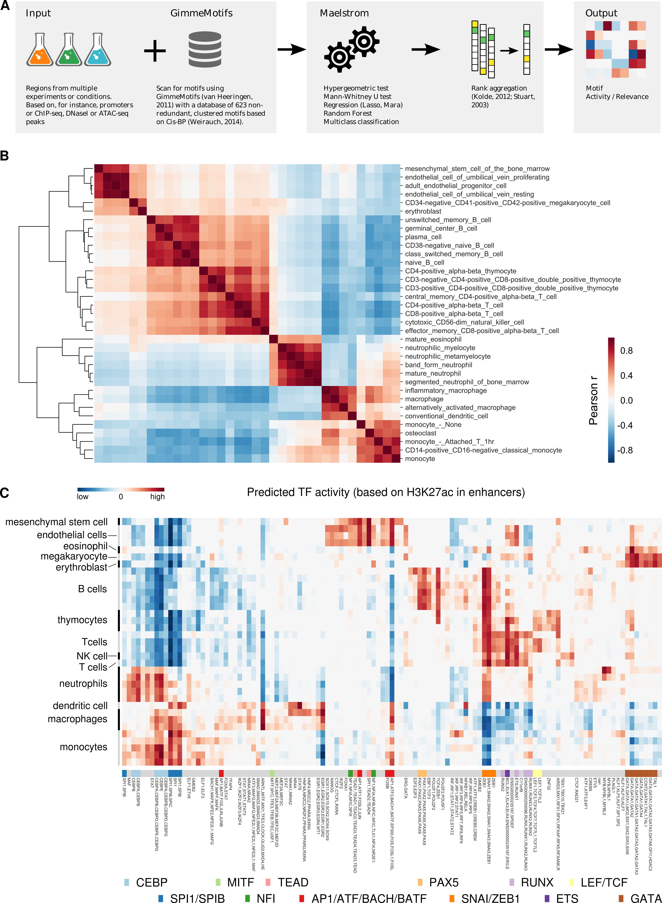

---
author-meta:
- Simon J. van Heeringen
date-meta: '2018-08-22'
keywords:
- transcription factor
- ChIP-seq
- regulatory motif
- TF motif
lang: en-US
title: 'GimmeMotifs: an analysis framework for transcription factor motif analysis'
...

<small><em>
This manuscript
([permalink](https://simonvh.github.io/gimmemotifs-manuscript/v/298812cb01c5dc6f30d7c5dbf8083cda6fdbe927/))
was automatically generated
from [simonvh/gimmemotifs-manuscript@298812c](https://github.com/simonvh/gimmemotifs-manuscript/tree/298812cb01c5dc6f30d7c5dbf8083cda6fdbe927)
on August 22, 2018.
</em></small>

## Authors

+ **Simon J. van Heeringen** 
    {height="13px" width="13px"}
    [0000-0002-0411-3219](https://orcid.org/0000-0002-0411-3219)
    · {height="13px" width="13px"}
    [simonvh](https://github.com/simonvh)
    · {height="13px" width="13px"}
    [svheeringen](https://twitter.com/svheeringen) 
  <small>
     Radboud University, Faculty of Science, Department of Molecular Developmental Biology, Radboud Institute for Molecular Life Sciences, 6500 HB Nijmegen, The Netherlands
     · Funded by Grant XXXXXXXX
  </small>

## Abstract {.page_break_before}

# Introduction

The regulatory networks that determine cell and tissue identity are robust, yet
remarkably flexible. Transcription factors (TFs) control the expression of genes
by binding to their cognate DNA sequences, TF motifs, in cis-regulatory
elements. To understand how genetic variation affects binding and to elucidate
the role of TFs in regulatory networks we need to be able to accurately model
binding of TFs to the DNA sequence.

The most widely adopted representation of TF binding is the position frequency
matrix (PFM). This matrix, a TF motif, contains (normalized) frequencies of each
nucleotide at each position in a collection of aligned binding sites. These PFMs
can be derived from high-throughput experiments such as ChIP-sequencing,
HT-SELEX or Protein Binding Microarrays (PBMs). 

Even though the PFM is a convenient representation, it has certain limitations.
A PFM cannot model inter-nucleotide dependencies, that are known to affect
binding of certain TFs. Multiple different representations have been proposed
[@Jc96vlRF; @1F4IFj9vd; @7nxD51Mq; @nswYGz33; @1FTeX7ahA],
however, no single one of these has gained much traction.  

Here, we present GimmeMotifs, a Python module and set of command-line tools for
TF motif analysis. Amongst other possibilities it can be used to perfom *de
novo* motif analysis, calculate enrichment statistics and identify differential
motifs. We illustrate the functionality of GimmeMotifs using three different
examples.

# Findings

We have developed GimmeMotifs to provide an comprehensive framework for
transcription factor motif analysis. It includes both command-line tools as well
as a Python API to perform all routine motif analysis experiments. Notably, we
present maelstrom, a new ensemble approach to determine differential motif activity
between two or more experiments. We illustrate the functionality of GimmeMotifs
using three examples.

## Benchmark of transcription factor motif databases

A variety of transcription factor (TF) motif databases have been published based
on different data sources. One of the most established is JASPAR, which consists
of a collection of non-redundant, curated binding profiles
[@XrrO63jn]. The JASPAR website contains many other tools and
the underlying databases are also accessible via an API
[@QMQpDahx]. Other databases are based on protein
binding micorarrays [@ZfeCID7o], HT-SELEX
[@ZFIFozC9] or ChIP-seq profiles [@YuvogFWT;
@jUNvk96Q; @1FStCACaF;
@14naBuW39]. CIS-BP integrates many individual motif
databases, and includes assignments of TFs to motifs bases based on DNA binding
domain homology [@1Df4blqEs].  

For the purpose of motif analysis, it is beneficial to have a database that is
non-redundant (i.e., similar motifs are grouped together), yet as complete as
possible (i.e., covers a wide variety of TFs). To establish a quantitative
measure of database quality, we evaluated how well motifs from different
databases can classify ChIP-seq peaks from background sequences. We downloaded
ChIP-seq peaks from ReMap 2018 [@LBF5EBTh], and used all TFs with at least 1,000
peaks. We then evaluated [XX] motif databases to test how well they could
distinguish peaks from random genomic sequences. When a data set contained more
than 5,000 peaks we randomly selected 5,000 peaks for the analysis. We included
the following databases: JASPAR 2018 vertebrate [@XrrO63jn],
FANTOM4 [ref], Homer [@14naBuW39], Factorbook
[@YuvogFWT], the ENCODE motifs from Kheradpour et al
[@jUNvk96Q], HOCOMOCO [@1FStCACaF], the RSAT
clustered motifs [@Pfmfeewp] and the motif database created by
Madsen et al.  [@X6uuBgy]. Figure 3A shows distribution of the
ROC AUC (area
under the curve for the Receiver Operator Curve) of the best motif per database
for all 294 transcription factors in a box plot. There is generally a wide
distribution of ROC AUCs. For some factors, such as ELK1, CTCF, CBFB and MYOD1,
peaks are relatively easy to classify using a single PWM motif. Other factors
don't have a peaks with a consistently enriched motif, or do not contain a
sequence-specific DNA-binding domain, such as EP300 or CD2 for example.

The difference in maximum ROC AUC between databases is on average not very
large, with a mean maximum difference of 0.05. The largest difference (~0.24) is
found for factors that were not assayed by ENCODE, such as ONECUT1, SIX2 and
TP73, and are therefore not present in the Factorbook motif database.
Unsurprisingly, the databases that were based on motif collections of different
sources (Kheradpour, Madsen, RSAT and Gimme) generally perform best.  It should
be noted that motif databases that were based on motif identification from
ChIP-seq peaks are expected to have an edge in this analysis.

While the ROC AUC is often used to compare the sensitivity versus speficity
trade-off, in this context it is not the best metric from a biological point of
view. An alternative way of measuring performance is evaluating the recall (ie.
how many true peaks do we recover) at a specific false discovery rate. This is
one of the criteria that has been used by the ENCODE DREAM challenge for
evaluation [@19QDk82XW]. Figure 3B shows scatterplots for the recall at 10% FDR for
all motif databases compared to the clustered, non-redundant databases that is
included with GimmeMotifs.  Differences of more than 0.025 are marked blue, and
less then -0.025 red. The non-redundant vertebrate motif database included with
GimmeMotifs shows better performance than most other databases. The
non-redundant RSAT database, which was created in a very similar manner, shows
similar performance.

These results illustrate how `gimme roc` can be used for evaluation of motifs.
The choice of a motif database can greatly influence the results of an analysis.
The default database included with GimmeMotifs shows good performance on the
metric evaluated here. However, this analysis illustrates only one specific use
case of application of a motif database. Especially well-curated databases, such
as JASPAR, can be beneficial, for instance when linking motifs to binding
proteins. 

## Performance of de novo motif identification varies with motif quality

It has been noted that there is no *de novo* motif prediction
algorithm that consistently performs well across different data sets
[@PNXlUYkS]. New approaches and algorithms for *de novo* motif
discovery continue to be published, however, many of them are not tested on more
than a few datasets. Benchmarks that have been published since Tompa et al.
[@NrirsKTi;@iW6hyGIk]
typically have tested only a few motif finders or used only a few datasets.

Here, we used the GimmeMotifs framework to benchmark 14 different *de novo*
motif finders. To evaluate the different approaches, we downloaded 495 peak
files for 270 proteins from ENCODE (Supplemental Table X; [@6eHRNaUT]) and
selected the 100bp sequence centered on the summit of top 5000 peaks.  Of those
peaks, half were randomly selected as a prediction set and the other half was
used for evaluation. As a background set we selected regions of the same length
flanking the original peaks. To assess the performance, we calculated two
metrics, the ROC AUC and the recall at 10% FDR. Figure 4a shows the distribution
of the ROC AUC scores over all ENCODE peaks in a boxplot, ordered by the mean
ROC AUC. The ROC AUC is distributed between 0.58 and 0.98, with a mean of 0.75.
All proteins that have low ROC AUC are not sequence-specific transcription
factors such as Pol2, Taf7 and Gtf2b, the PRC2-subunit Suz12 and the H3K9
methyltransferase Setdb1. The factors with the highest ROC AUC are CTCF and
members of the cohesin complex, Smc3 and Rad21, that bind at CTCF sites. 

Generally, the ROC AUC distribution of all evaluated motif finders is very
similar. However, a few outliers can be observed. Trawler, Posmo and, to a
lesser extent, GADEM show an overall lower distribution of ROC AUC scores.
Compared to the ROC AUC scores of the next best program, Weeder, this is
significant (p < 1e-5, Wilcoxon signed-rank). Selecting the best motif for each
experiment results in a ROC AUC distribution that is significantly higher than
the best single method, BioProspector (p < 4e-21, Wilcoxon signed-rank).

As stated in the previous section, the ROC AUC is not the best measure to
evaluate motif quality. Therefore, we selected for every peak set the best motif
from all motifs predicted by the different motif finders on the basis of the
recall at 10% FDR. We then plotted the difference between the best motif from
each individual *de novo* approach with this best overall motif (Figure 4b). For
this figure, we used only the data sets where at least one motif had a recall
higher than 0 at 10% FDR. 

In line with previous results [@PNXlUYkS], there is no single tool that
consistently predicts the best motif for each transcription factor. However, the
motifs predicted by BioProspector, MEME and Homer are, on basis of this metric,
consistently better than motifs predicted by other methods. In 75% the cases,
the motif predicted by BioProspector has a difference in recall smaller than
0.026 compared to the best overall motif. In this benchmark, four programs
(Trawler, Improbizer, Posmo and Weeder) generally perform worse than average,
with a mean decrease in recall of [5%] to [10], as compared to the best motif.
In addition, these programs tend to have a much more variable performance
overall.

Predicted motifs identified using MEME with different motif widths show better performance than
running MEME with the `minw` and `maxw` options (MEME vs. MEMEW in fig. 4b). Of
the best performing algorithms, both MEME and BioProspector were not
specifically developed for ChIP-seq data, however, they consistently outperform
most methods created for ChIP-seq data. Of the ChIP-seq motif finders Homer
consistently shows good performance.

Finally, to gain further insight into *de novo* motif finder performance, we
stratified the ChIP-seq datasets by motif "quality". We divided the
transcription factors into five bins on basis of the ROC AUC score of the best
motif. For each bin we ranked the tools on basis of the average of three metrics
(ROC AUC, recall at 10% FDR and MNCP [@s6kAz7UG]). The results are visualized as a
heatmap in Figure 4c. From this visualization, it is again clear that
BioProspector, MEME and Homer produce consistently high-ranking motifs, while
the motifs identified by Trawler, Posmo, GADEM and Improbizer generally have the
lowest rank. Interestingly, for some motif finders, there is a relation between
motif presence and the relative rank. Weeder, XXMotif and MDmodule yield
relatively high-ranking motifs when the ROC AUC of the best motif for the data
set is low. On the other hand, ChIPMunk shows the opposite pattern. Apparently
this algorithm works well when a motif is present in significant fraction of the
data set [TODO: check oop param].

These results illustrate that motif finders need to be evaluated along a broad range of
data sets with different motif presence and quality. Another interesting
observation is that this ChIP-seq benchmark shows a lower-than-average
performance for Weeder, which actually was one of the highest scoring in the
Tompa et al. benchmark.  It should be noted that our metric specifically
evaluates how well *de novo* motif finders identify the primary motif in the
context of ChIP-seq peaks. It does not evaluate other aspects that might be
important, such as the ability to identify many low-abundant motifs.
Furthermore, with ChIP-seq data there are usually many peaks available. This
allows for other algorithms than those that work well on a few sequences.
Interestingly, the original MEME shows consistently good performance, although
the running time is longer than most other tools.  On the basis of this
analysis, BioProspector should be the top pick for a program to identify primary
motifs in ChIP-seq data. However, an ensemble program such as GimmeMotifs will
report high-quality motifs more consistently than any single tool.

## Differential motif analysis of hematopoietic enhancers identifies cell type-specific regulators

While many motif scanners and methods to calculate enrichment exist, there are few
methods to compare motif enrichment or activity between two or more data
sets. The CentriMo algorithm from the MEME suite implements a differential
enrichment method to compare to samples [@eQM67dJD]. The regression approach MARA [@KGmXK8UO], as
implemented in ISMARA [@3d6POy0h] normalizes between data sets before
regression. Here we present the maelstrom algorithm that integrates different
methods to determine motif relevance or activity in an ensemble approach (Fig.
5A).

To demonstrate the utility of maelstrom we identified motif activity based on
enhancers in hematopoietic cells. We downloaded 72 human hematopoietc DNAseI
experiments (Supplemental Table X), called peaks, and created a combined peak
set as a collection of putative enhancers. In addition we downloaded 193
hematopoietic H3K27ac ChIP-seq experiments, mainly from BLUEPRINT
[@MzCvXTgB] (Supplemental Table X). We determined the number of H3K27ac reads per
enhancer. After log2 transformation and scaling, we selected the 50,000 most
dynamic peaks. Figure 5B shows the correlation of the H3K27ac enrichment in
these 50,000 enhancers between cell types. For this plot, replicates were
combined by taking the mean value and all experiments corresponding to treated
cells were removed. We can observe five main clusters 1) non-hematopoietic
cells, megakaryocyte and erothrocytes 2), lymphoid cells, 3) neutrophilic cells,
4) macrophages and dendritic cells and 5) monocytes. The lymphoid cluster furthermore seperates between B-cells and T- and NK cells and non-hematopoietic cells are distinct from the megakaryocytes and erythroblasts. We can conclude that the H3K27ac profile within this enhancers set recapitulates a cell type-spefific regulatory signal.

To determine differential motif activity from these dynamic enhancers we used
maelstrom. We combined Bayesian ridge regression, multi-class regression using
coordinate descent [@6chpTZMZ] and regression with boosted trees [@8w9fI63O].
The coefficients or feature importances were ranked and combined using rank
aggregation [@dTwzcIZ4]. A p-value was calculated for consistentily high ranking and
consistently low ranking motifs. The results are visualized in Figure 5C. 

Two of the most signicant motifs are SPI1 (PU.1) and CEBP. The motif activity
for SPI1 is consistently high in monocytes and macrophages, consistent with its
role in myeloid lineage commitment [refs]. The CEBP family members are important for monocytes and granulocitic cells [ref], and show a high motif activity in neutrophils and monocytes. Other strong motifs include RUNX for T cells and NK cells, GATA1 for erythroid cells. 

We identified a strong activity for motifs representing the ZEB1 and Snail
transcription factors. The Snail transcription factors play an important role in
the epithelial-to-mesenchymal transition (EMT), and their role in hematopoietic
cells is less well-described. However, recently Snai2 and Snai3 were found to be
required to generate mature T and B cells [@60Dz9zIg;@ndDtTItn] in mice. ZEB1
is expressed in T cells and represses expression of IL-2 [@vhkaSeK9], as well as
other immune genes such as CD4 [@YfRzUAEm] and GATA3 [@EN0Mcnx6]. ZEB1
knockout mice exhibit a defect in thymocyte development [@zbTimXyu]. Together,
this suggests that these TFs play an important role in lymphocyte development. 

Finally, an interesting observation is the predicted motif activity of NANOG in
endothelial cells. NANOG is expressin in embryonic stem cells and is essential
for establishment and maintenance of pluripotency [ref]. However, NANOG is
indeed expressed in endothelial cells and has been shown to play a role in
endothelial proliferation and angiogenesis [@dWdvt1AI].

# Methods

## GimmeMotifs

### Implementation

GimmeMotifs is implemented in Python, with the motif scanning incorporated as a
C module.  The software is developed on GitHub
([https://github.com/simonvh/gimmemotifs/](https://github.com/simonvh/gimmemotifs/))
and documentation is available at
[https://gimmemotifs.readthedocs.io](https://gimmemotifs.readthedocs.io).
Functionality is covered by unit tests, which are run through continuous
integration. GimmeMotifs can be installed via bioconda
[@sYguBb3Q], see
[https://bioconda.github.io/](https://bioconda.github.io/) for details.  All
releases are also distributed through PyPi [@ycIGJh3s] and stably
archived using Zenodo [@JnK7ipTw]. For *de novo* motif search,
14 different external tools are supported (Table [X]). All of these are
installed when conda is used for installation. By default,
[genomepy](https://github.com/simonvh/genomepy) is used for genome management
[@4AHAVuXG]. In addition, GimmeMotifs uses the following Python
modules: numpy [@oGbMixLl], scipy [@D3KtiDQL],
scikit-learn, scikit-contrib-lightning [@6chpTZMZ],
seaborn [@WESOG7Bx], pysam
[@13M7e8OcQ;@hNfNHk9L], xgboost
[@8w9fI63O] and pandas. In addition to the
command line tools, all GimmeMotifs functionality is available through a Python
API.

### *De novo* motif prediction pipeline

Originally, GimmeMotifs was developed to predict *de novo* motifs from ChIP-seq
data using an ensemble of motif predictors [@11x7W2xZq]. The tools
currently supported are listed in Table [X]. The pipeline is depicted in [Fig
X]. An input file (BED, FASTA or narrowPeak format) is split into a prediction and
validation set. The prediction set is used to predict motifs, and the validation
set is used to filter for significant motifs. All significant motifs are
clustered to provide a collection of non-redundant *de novo* motifs.  Finally,
significant clustered motifs are reported, along with several statistics to
evaluate motif quality, calculated using the validation set. These evaluation
metrics include ROC AUC, distribution of the motif location relative to the
center of the input (i.e., the ChIP-seq peak summit) and the best match in a
database of known motifs.

| Name          | Citation |
|:------------- |:---------|
| [AMD](https://github.com/JiantaoShi/AMD) | [@1BgOvt0PL] |
| [BioProspector](http://ai.stanford.edu/~xsliu/BioProspector/) | [@Zg6SmzaV]  |
| [ChIPMunk](http://autosome.ru/chipmunk/) | [@smdkzwHK]  |
| [GADEM](https://www.niehs.nih.gov/research/resources/software/biostatistics/gadem/index.cfm) | [@8xwckKK3]  |
| [HMS](https://dx.doi.org/10.1093/nar/gkp1180) | [@YIsvgfWU] | 
| [Homer](http://homer.ucsd.edu/homer/motif/) | [ @14naBuW39] |
| [Improbizer](https://users.soe.ucsc.edu/~kent/improbizer/improbizer.html) | [@wUklcuxK]  |
| [MDmodule](https:/dx.doi.org/10.1038/nbt717) | [@aZ8ZieVF] |
| [MEME](http://meme-suite.org/) | [@KqGAZzyz] |
| [MotifSampler](http://bioinformatics.intec.ugent.be/MotifSuite/motifsampler.php) | [@FGUIIeyX] |
| [Posmo](https://dx.doi.org/10.1093/nar/gkr1135) | [@oL2CQf3y] |
| [Trawler](https://trawler.erc.monash.edu.au/) | [@19jTKi9ZQ] |
| [Weeder](http://www.beaconlab.it/modtools) | [@1G4lWf9Jf] | 
| [XXmotif](https://github.com/soedinglab/xxmotif) | [@QzszdQqA] |

  : Table [X]: External *de novo* motif prediction tools supported by GimmeMotifs.

### Motif activity by ensemble learning: maelstrom

GimmeMotifs implements eight different methods to determine differential motif
enrichment between two or more conditions. In addition, these methods can be
combined in a single measure of *motif activity* using rank aggregation. Four
methods work with discrete sets, such as different peak sets or clusters from a
K-means clustering. The hypergeometric test uses motif counts with an empirical
motif-specific FPR of 5%. All other implemented methods use the PFM log-odds
score of the best match. 

The hypergeometric test is commonly used to calculate motif enrichment, for instance
by Homer [@14naBuW39]. In GimmeMotifs, motifs in each cluster are tested against the
union of all other clusters. The reported value is -log10(p-value) where the p-value
is adjusted by the Benjamini-Hochberg procedure [@1HL2L6Bup]. 

Using the non-parametric
Mann-Whitney U test, GimmeMotifs tests the null hypothesis that that the motif
log-odds score distributions of two classes are equal. For each discrete class
in the data, such as a cluster, it compares the score distributions of the class
to the score distribution of all other classes. The value used as activity is
the -log10 of the Benjamini-Hochberg adjusted p-value. 

The two other methods are classification algorithms: random forest
using scikit-learn and a large-scale multiclass classifier using
block coordinate descent [@6chpTZMZ] as implemented in the 
scikit-contrib-lightning module. The classifier in GimmeMotifs uses a l1/l2 penalty
with squared hinge loss where the alpha and C parameters are set using grid
search in 10 fold cross-validation procedure.

The other four methods that are implemented relate motif score to an
experimental measure such as ChIP-seq or ATAC-seq signal or expression level.
These are all different forms of regression. In addition to ridge regression, which  is similar to
Motif Activity Response Analysis (MARA) [@KGmXK8UO;@3d6POy0h], these methods include
regression using boosted trees (XGBoost [@8w9fI63O]), multiclass regression [@6chpTZMZ]
and L1 regularized regression (LASSO).

To combine different measures of motif significance or activity into a single
score, ranks are assigned for each individual method and combined using rank
aggregation based on order statistics [@dTwzcIZ4]. This results in a
probability of finding a motif at all observed postiions. We use the method
implemented in the R package RobustRankAggreg [@15HHsoLKA]. The rank aggregation
is performed twice, once with the ranks reversed to generate both positively and
negatively associated motifs.

## Clustering

## Transcription factor motif database benchmark

We downloaded all ChIP-seq peaks from Remap 2018 v1.2 [@LBF5EBTh]
([http://tagc.univ-mrs.fr/remap/index.php?page=download](http://tagc.univ-mrs.fr/remap/index.php?page=download)).
We removed all factors with fewer than 1000 peaks and created regions of 100 bp
centered at the peak summit. Background files were created for each peak set
using bedtools shuffle [@1HWiAHnIw], excluding the hg19 gaps and the peak regions.
The ROC AUC and Recall at 10% FDR statistics were calculated using `gimme roc`.
The workflow is implemented in snakemake [@NcYZqBux] and is available at
[https://github.com/simonvh/gimme_analysis](https://github.com/simonvh/gimme_analysis).

## `De novo` motif prediction benchmark

We downloaded all spp ENCODE peaks (January 2011 data freeze) from the EBI FTP
([http://ftp.ebi.ac.uk/pub/databases/ensembl/encode/integration_data_jan2011/byDataType/peaks/jan2011/spp/optimal/](http://ftp.ebi.ac.uk/pub/databases/ensembl/encode/integration_data_jan2011/byDataType/peaks/jan2011/spp/optimal/)).
We selected the top 5000 peaks and created 100bp regions centered on the peak
summit. As background we selected 100 bp regions flanking the original peaks.
For the `de novo` motif search default settings for `gimme motifs` were used. The
workflow is implemented in snakemake [@NcYZqBux] and is available at
[https://github.com/simonvh/gimme_analysis](https://github.com/simonvh/gimme_analysis).

## Motif analysis of hematopoietic enhancers

To illustrate the functionality of `gimme maelstrom` we analyzed an integrated
collection of hematopoietic enhancers. We downloaded all H3K27ac ChIP-seq and
DNase I data from BLUEPRINT (Supplemental Table SX) and hematopoietic DNase I
data from ROADMAP (Supplemental Table SX). All DNase I data were processed using
the Kundaje lab DNase pipeline version 0.3.0
[https://github.com/kundajelab/atac_dnase_pipelines](https://github.com/kundajelab/atac_dnase_pipelines)
[@PPuptgFe].  The ChIP-seq samples were processed using the
Kundaje lab AQUAS TF and histone ChIP-seq pipeline
[https://github.com/kundajelab/chipseq_pipeline](https://github.com/kundajelab/chipseq_pipeline).
For all experiments from BLUEPRINT we used the aligned reads provided by EBI.
All ROADMAP samples were aligned using bowtie2 [@PiS0h6Mu] to the
hg38 genome. DNase I peaks were called using MACS2
[@MG7PTly9]. We merge all DNase I peak files and centered
each merged peak on the summit of the strongest individual peak. H3K27ac reads
were counted in a region of 2kb centered at the summit (Supplementary Table SX)
and read counts were log2-transformed and scaled. We removed all samples that
were treated and averaged all samples from the same cell type. We then selected
all enhancers with at least one sample with a scaled log2 read count of 2,
sorted by the maximum difference in normalized signal between samples and
selected the 50,000 enhancers with the largest difference. Using this enhancer
collection as input, we ran `gimme maelstrom` using default settings. The motif
analysis workflow is implemented in a Jupyter notebook and is available at
[https://github.com/simonvh/gimme_analysis](https://github.com/simonvh/gimme_analysis).

# Conclusions

We demonstrated the functionality of GimmeMotifs with three examples. First, to
evaluate different public motif databases, we quantified their performance on
distinguishing ChIP-seq peaks from background sequences. The databases that
perform best on this benchmark are collections of motifs from different
sources. Of the individual databases HOCOMOCO and Factorbook rank highest
using this collection of human ChIP-seq peaks. Based on our results it is
recommended to use a composite database, such as the RSAT clustered motifs or
the GimmeMotifs database, for the best vertebrate motif coverage. However,
these motifs are less well annotated. For instance, motifs based on ChIP-seq
peaks from some sources might be from co-factors or cell type-specific
regulators instead of the factor that was assayed. An example are motifs that
associated with the histone acetyl tranferase EP300. This transcriptional
co-activator lacks a DNA binding domain, and associated motifs depend on the
cell type. For instance, in a lymphoblastoid cell line such as GM12878 these
include PU.1 and AP1. The lack of high-quality annotation makes it more
difficult to reliably link motifs to transcription factors. This can be an
advantage of using JASPAR. Although the motifs might not be optimal, JASPAR
contains high-quality metadata that is manually curated.  

In the second example, we benchmarked 14 different *de novo* motif finders
using a large compendium of ChIP-seq data. While performance can vary between
different data sets, there are several *de novo* motif finders that
consistently perform well, with BioProspector, MEME and Homer as top
performers. Interestingly, only Homer was specifically developed for ChIP-seq
data. An ensemble approach such as GimmeMotifs still improves on the use of
individual tools. This example also illustrates that newly developed *de novo*
motif finders should be evaluated on many different data sets, as this is
necessary to accurately judge the performance. 

Finally, we presented a new ensemble approach, *maelstrom*, to
determine motif activity in two or more epigenomic and transcriptomic data
sets. Using H3K27ac ChIP-seq signal as a measure for enhancer activity, we
analyzed cell-type specific motif activity in a large collection of
hematopoietic cell types. We identified known lineage regulators, as well as
motifs for factors that are less well studied in the hematopoietic lineage.
This illustrates how `gimme maelstrom` can serve to identify cell type-speficic
transcription factors.

In conclusion, GimmeMotifs is a flexible and highly versatile framework for
transcription factor motif analysis. Both command line and programmatic use in
Python are supported. One planned future improvement to GimmeMotifs is the
support of more sophisticated motif models. Although PFMs are very informative,
it is clear that it is an oversimplification of TF binding preferences. While
several approaches that incorporate positional dependencies have been
developed, it is still unclear how well these models perform and their use
depends on specific tools. Supporting these different models and benchmarking
their performance relative to high-quality PFMs will simplify their use and
give insight into their benefits and disadvantages.  Secondly, there is a lot
of progress in modeling TF binding using deep neural networks (DNNs). These
DNNs can learn sequence motifs, as well as complex inter-dependencies, directly
from the data. However, interpretation becomes less straightforward. Although
it is possible, we think that analyzing and understanding a trained DNN can
benefit from high-quality motif databases and comparative tools such as
GimmeMotifs. 

# Availability and requirements

* Project name: GimmeMotifs
* Project home page: https://github.com/simonvh/gimmemotifs
* Operating system(s): Linux, Mac OSX
* Programming language: Python 3 
* Other requirements: *de novo* motif finders
* License: MIT

# Availability of supporting data

# Additional files

# Competing interests

The authors declare that they have no competing interests.

# Funding

SJvH was supported by the Netherlands Organization for Scientific research
(NWO-ALW, grant 863.12.002). Part of this work was carried out on the Dutch
national e-infrastructure with the support of SURF Foundation. This work was
sponsored by NWO Exact and Natural Sciences for the use of supercomputer
facilities.

# Acknowledgements

## References {.page_break_before}

<!-- Explicitly insert bibliography here -->

